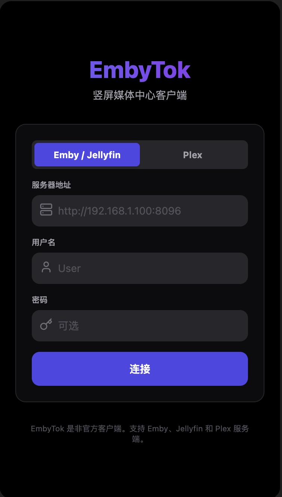
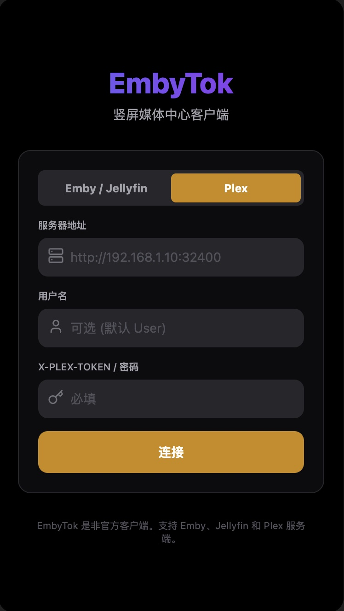

# EmbyTok

EmbyTok 是一个为 Emby 媒体服务器设计的竖屏视频浏览客户端，提供类似 TikTok 的体验，让用户能够以更现代、便捷的方式浏览个人媒体库。

<div style="display:flex; flex-direction:row;">




</div>
~
<div style="display:flex; flex-direction:row;">


</div>

## 功能特性

- 📱 **TikTok 式浏览体验**：全屏竖屏视频浏览，上下滑动切换视频
- 🎵 **音频控制**：一键静音/取消静音，直观的音量图标反馈
- ❤️ **收藏功能**：点赞并收藏喜欢的视频，支持在收藏夹中浏览
- 🔍 **多种浏览模式**：
  - 最新视频
  - 随机推荐
  - 收藏夹
- 📁 **媒体库管理**：支持多个媒体库的浏览、选择和隐藏
- 🌐 **响应式设计**：适配移动端和桌面端，自动调整布局
- ⏩ **滑动控制进度**：左右滑动调整视频播放进度
- 📦 **Android 应用**：可通过 Capacitor 构建为原生 Android 应用
- 📱 **视图切换**：支持视频流视图和网格视图的一键切换
- 📐 **方向过滤**：可选择只显示垂直、水平或两者都显示的视频
- 🖥️ **全屏模式**：支持进入/退出全屏播放
- 🎯 **自动布局**：根据屏幕方向和视频内容方向自动调整最佳显示方式
- 📱 **竖屏优化**：专为手机竖屏体验优化的界面设计
- ♾️ **无限连播模式**：无限连播+纯净模式，自动连续播放视频
- 📱 **平板模式**：支持平板模式
- ⚡ **2倍速播放**：长按视频可开启2倍速播放，再次长按恢复正常速度
- 🎨 **纯净模式**：连播模式下隐藏所有UI元素，提供沉浸式观看体验
- 📺 **电视剧库适配**：支持电视剧库浏览，完美适配短剧刷剧体验
- 📑 **多级导航**：支持电视剧集、季度、单集的深度浏览与逐级返回
- 📍 **断点续播**：同步播放进度，在网格视图中高亮提示上次观看位置
- ✋ **增强手势控制**：
  - 点击播放/暂停
  - 左右滑动调整播放进度
  - 长按开启2倍速播放
- 📢 **自动播放提示**：开启连播模式时显示直观的提示通知
- 📐 **智能适配**：根据视频内容方向自动调整显示方式（垂直/水平）
- 🎯 **精准进度控制**：仅对长视频显示进度条，优化界面简洁性
- 📺 **电视模式**：专为智能电视和大屏幕设备优化的界面
  - 全新UI，专为大屏电视设计
  - 遥控器友好的导航系统
  - 支持电视APK下载（Gitee发行版）
  - 支持电脑HTPC模式，全屏下键盘控制
- 🗑️ **删除视频功能**：支持删除不需要的视频
- ⚡ **快速滑动切换**：快速滑动即可切换到下一个视频
- 📱 **多架构支持**：支持X86+ARM镜像，适配不同硬件平台

## 技术栈

- React 18
- TypeScript
- Vite
- Tailwind CSS
- Capacitor (用于构建 Android 应用)
- Lucide React (图标)
- 多架构 Docker 支持 (AMD64/ARM64)
- Nginx 生产环境部署
- PWA 支持

## 安装和设置

### 前置要求

- Node.js (v14 或更高版本)
- npm 或 yarn

### 安装步骤

1. 克隆仓库：
   ```bash
   git clone <repository-url>
   cd embytok
   ```

2. 安装依赖：
   ```bash
   npm install
   ```

3. 启动开发服务器：
   ```bash
   npm run dev
   ```

4. 构建生产版本：
   ```bash
   npm run build
   ```

## 使用方法

1. 启动应用后，在登录界面输入您的 Emby 服务器信息：
   - 服务器地址（例如：http://192.168.1.100:8096）
   - 用户名
   - 密码（如果需要）

2. 登录成功后，您可以：
   - 上下滑动浏览视频
   - 点击视频播放/暂停
   - 使用右侧控制栏点赞、查看信息、控制音频
   - 通过左上角菜单切换媒体库和浏览模式
   - 左右滑动控制视频播放进度
   - 点击网格图标切换到网格视图

## 构建 Android 应用

1. 确保您已安装 Android Studio 和 Android SDK

2. 添加 Android 平台：
   ```bash
   npm run cap:add
   ```

3. 同步项目：
   ```bash
   npm run cap:sync
   ```

4. 构建 APK：
   ```bash
   ./build-apk.sh
   ```

## Docker 部署

项目包含 Docker 支持，可以轻松部署为 Web 应用。支持多架构（AMD64/ARM64），可在不同硬件平台上运行。

### 镜像信息

- **镜像名称**：crpi-90mw3693mrc3nsxp.cn-shanghai.personal.cr.aliyuncs.com/migumigu/embytok
- **支持架构**：AMD64 (x86_64), ARM64 (aarch64)
- **标签**：latest, 1.0.2

### 直接使用 Docker 命令

```bash
# 拉取并运行镜像（Docker 会自动选择适合您硬件架构的版本）
docker run -d \
  --name embytok-web \
  --restart unless-stopped \
  -p 8080:80 \
  crpi-90mw3693mrc3nsxp.cn-shanghai.personal.cr.aliyuncs.com/migumigu/embytok:latest
```

### 使用 Docker Compose

#### 简单部署

使用 `docker-compose.simple.yml` 进行快速部署：

```yaml
version: '3.8'

services:
  # EmbyTok 前端应用 - 简单版配置
  embytok:
    image: crpi-90mw3693mrc3nsxp.cn-shanghai.personal.cr.aliyuncs.com/migumigu/embytok:latest
    container_name: embytok-web
    restart: unless-stopped
    ports:
      - "5175:80"  # Web界面端口
    environment:
      - NODE_ENV=production
    network_mode: bridge
networks: {}
```

运行简单配置：

```bash
docker-compose -f docker-compose.simple.yml up -d
```

默认情况下，应用将在端口 5175 上可用。

#### 使用 Docker Hub 镜像

使用 Docker Hub 上的官方镜像进行部署：

```yaml
version: '3.8'

services:
  # EmbyTok 前端应用 - Docker Hub 镜像版本
  embytok:
    image: <your-dockerhub-username>/embytok:1.2.2
    container_name: embytok-web
    restart: unless-stopped
    ports:
      - "5175:80"  # Web界面端口
    environment:
      - NODE_ENV=production
    network_mode: bridge
networks: {}
```

**使用说明**：
1. 将 `<your-dockerhub-username>` 替换为您的 Docker Hub 用户名
2. 运行配置：
   ```bash
   docker-compose up -d
   ```
3. 默认情况下，应用将在端口 5175 上可用

**镜像信息**：
- 支持架构：X86 (amd64) 和 ARM (arm64)
- 版本标签：1.2.2, latest

## 配置

应用使用 localStorage 存储以下用户配置：
- 服务器配置（URL、用户ID、访问令牌）
- 隐藏的媒体库列表

## 贡献

欢迎提交 Issue 和 Pull Request 来改进这个项目。

## 许可证

[MIT License](LICENSE)

## 免责声明

EmbyTok 是一个非官方的 Emby 客户端，与 Emby 官方没有关联。使用时请确保遵守您所在地区的相关法律法规。

## 赞助支持

如果您喜欢这个项目，可以通过以下方式赞助支持：

<div style="display:flex; flex-direction:row; gap:20px; justify-content:center;">
### 支付宝

  

### 微信支付


</div>

您的支持将帮助我持续改进和维护这个项目，感谢您的关注与支持！